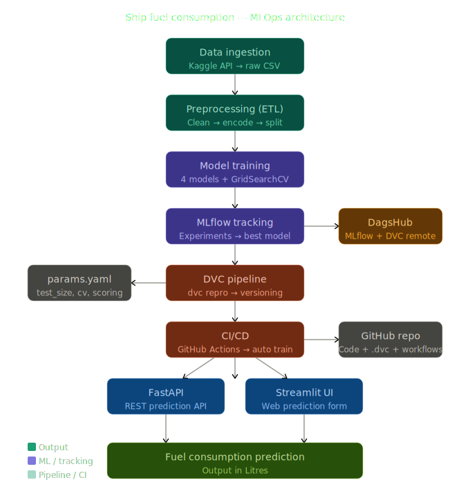

# Ship Fuel Consumption Prediction — MLOps Project

A complete end-to-end MLOps pipeline for predicting ship fuel consumption using machine learning, with automated training, experiment tracking, and a web interface.

---

# Project Overview

This project predicts **ship fuel consumption (in Litres)** based on ship characteristics like type, distance, fuel type, weather conditions, and engine efficiency. It follows a full MLOps lifecycle including data ingestion, preprocessing, model training, experiment tracking, CI/CD automation, and deployment-ready API and UI.

---

## Project Structure

```
project-Mlflow/
├── src/
│   ├── data_ingestion.py       # Data Extract from Kaggle 
│   ├── preprocessing.py        # Data clean + transform + load
│   ├── train.py                # Model training + MLflow tracking
│   ├── best_model.py           # Best model select + register
│   └── prediction.py           # Single prediction script
├── .github/
│   └── workflows/
│       └── train.yml           # CI/CD GitHub Actions pipeline
├── data_&_model/               # Preprocessing steps validation
├── app.py                      # FastAPI prediction API
├── streamlit_app.py            # Streamlit web UI
├── dvc.yaml                    # DVC pipeline stages
├── dvc.lock                    # DVC pipeline lock file
├── params.yaml                 # Hyperparameters & config
├── requirements.txt            # Python dependencies
└── README.md
```

---

##  Tech Stack

| Tool | Purpose |
|---|---|
| **Python** | Core language |
| **Scikit-learn** | ML models |
| **MLflow** | Experiment tracking & model registry |
| **DVC** | Data & pipeline versioning |
| **DagsHub** | Remote storage + MLflow hosting |
| **FastAPI** | REST API for predictions |
| **Streamlit** | Web UI for predictions |
| **GitHub Actions** | CI/CD automation |

---



---

##  Dataset

- **Source:** [Kaggle — Ship Fuel Consumption & CO2 Emissions Analysis](https://www.kaggle.com/datasets/jeleeladekunlefijabi/ship-fuel-consumption-and-co2-emissions-analysis)
- **Records:** 1,440
- **Target:** `fuel_consumption` (Litres)

### Features Used:
| Feature | Type |
|---|---|
| ship_type | Categorical |
| month | Categorical |
| distance | Numerical |
| fuel_type | Categorical |
| weather_conditions | Categorical |
| engine_efficiency | Numerical |

---

##  Models Trained

| Model | Train R2 | Test R2 | Status |
|---|---|---|---|
| Linear Regression | 0.9424 | 0.9474 | ✅ Good Fit |
| Decision Tree | 0.9677 | 0.9520 | ✅ Good Fit |
| **Random Forest** | **0.9677** | **0.9584** | ✅ **Best Model** |
| Gradient Boosting | 0.9712 | 0.9556 | ✅ Good Fit |

---

##  MLOps Pipeline

```
Kaggle Data
      ↓
data_ingestion.py   →   Raw CSV save
      ↓
preprocessing.py    →   Clean + Encode + Split
      ↓
train.py            →   4 Models train + MLflow track
      ↓
best_model.py       →   Best model register (DagsHub)
      ↓
FastAPI + Streamlit →   Prediction UI
```

---

## 🚀 Getting Started

### 1. Clone the Repository
```bash
git clone https://github.com/Abdul1302/project-Mlflow.git
cd project-Mlflow
```

### 2. Create Virtual Environment
```bash
python -m venv venv
venv\Scripts\activate      # Windows
source venv/bin/activate   # Mac/Linux
```

### 3. Install Dependencies
```bash
pip install -r requirements.txt
```

### 4. Setup Environment Variables
Create `.env` file in root:
```
MLFLOW_TRACKING_URI=https://dagshub.com/your_username/your_repository.mlflow
MLFLOW_TRACKING_USERNAME=your_username
MLFLOW_TRACKING_PASSWORD=your_dagshub_token
```

### 5. Run DVC Pipeline
```bash
dvc repro
```

### 6. Run FastAPI
```bash
uvicorn app:app --reload
```

### 7. Run Streamlit UI
```bash
streamlit run streamlit_app.py
```

---

##  CI/CD Pipeline

Every push to `main` branch automatically:

1. ✅ Checks out code
2. ✅ Installs dependencies
3. ✅ Runs DVC pipeline (`dvc repro`)
4. ✅ Trains all models
5. ✅ Registers best model on DagsHub
6. ✅ Updates `dvc.lock`

---

##  API Usage

### FastAPI Swagger UI
```
http://localhost:8000/docs
```

### Predict Endpoint
```bash
POST http://localhost:8000/predict
```

**Parameters:**
```json
{
  "ship_type": "Cargo",
  "month": "January",
  "distance": 150,
  "fuel_type": "Diesel",
  "weather_conditions": "Clear",
  "engine_efficiency": 82
}
```

**Response:**
```json
{
  "predicted_fuel_consumption": 3245.67,
  "unit": "Litres"
}
```

---

##  params.yaml

```yaml
data:
  test_size: 0.2
  random_state: 42

model:
  cv: 5
  scoring: r2
```

Change any value and run `dvc repro` — pipeline automatically retrains!

---

##  Links

- **DagsHub Repo:** https://dagshub.com/Abdul1302/project-Mlflow
- **GitHub Repo:** https://github.com/Abdul1302/project-Mlflow

---

##  Author

**Abdul Rehman**
- GitHub: [@Abdul1302](https://github.com/Abdul1302)
- DagsHub: [@Abdul1302](https://dagshub.com/Abdul1302)
